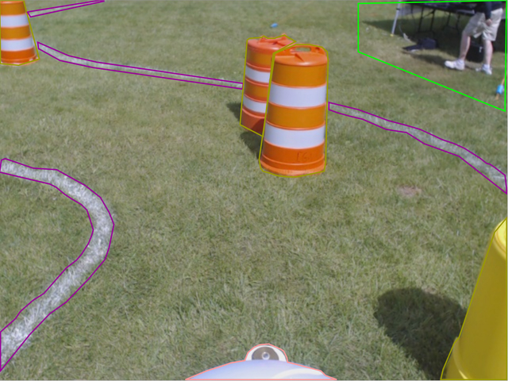

# Labelme to Binary Image

This tool allows you to convert images from the [web](http://labelme.csail.mit.edu/) or [desktop](https://github.com/wkentaro/labelme) versions of labelme into binary images.

## Usage

```bash
python toBinary.py [-h] [--nosave] [--preview] file/folder {png,jpg} labels [labels ...]

positional arguments:
  file/folder        path to input file/folder (json/xml/folder)
  {png,jpg}          output file type
  labels             labels to include in the image

optional arguments:
  -h, --help         show this help message and exit
  --savedir SAVEDIR  directory to save images in (default: masks)
  --nosave           dont save image
  --preview          show image preview
  --bgcolor COLOR    background color
  --fgcolor COLOR    foreground (label) color
```

## Screenshots
Original Image from LabelMe:



`python toBinary.py Example/example.xml jpg line`:


`python toBinary.py Example/example.xml jpg barrel`:

